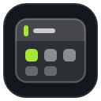
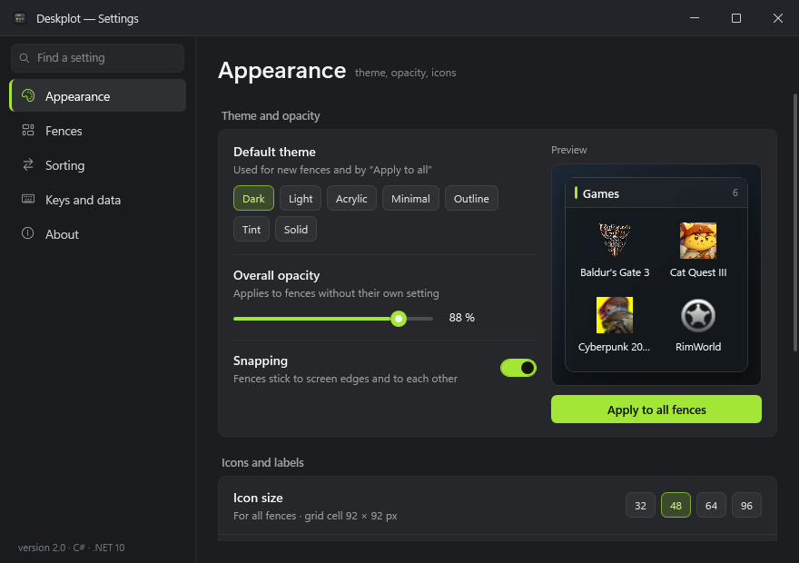
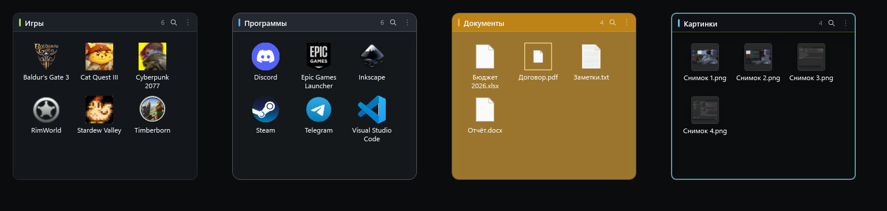
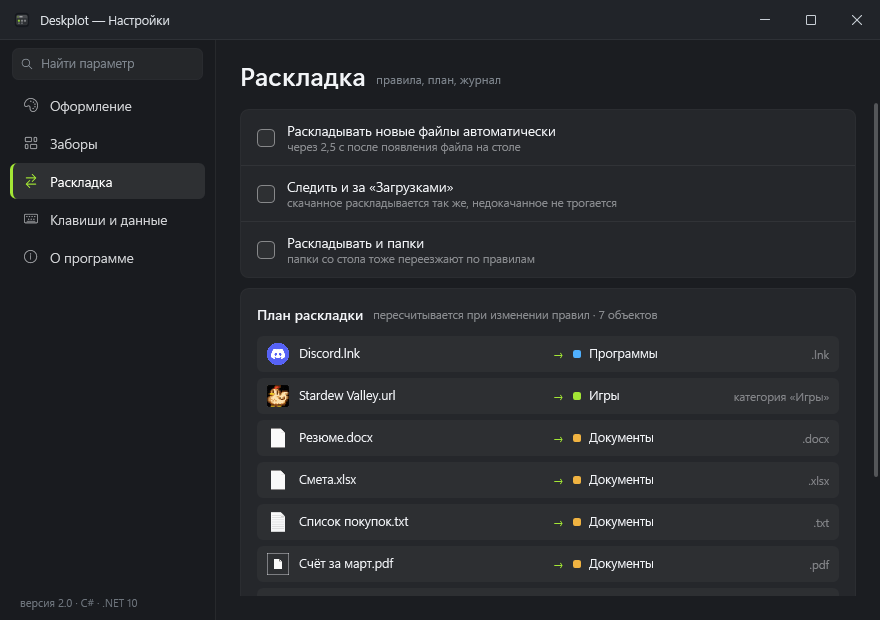

<p align="center"></p>
<h1 align="center">Deskplot</h1>
<p align="center">A desktop organizer for Windows 10 / 11 · Органайзер рабочего стола для Windows 10 / 11</p>
<p align="center">
  <a href="https://github.com/dimasuhanov7-ops/deskplot/releases/latest"></a>
  <a href="https://github.com/dimasuhanov7-ops/deskplot/releases"></a>
  <a href="LICENSE"></a>
</p>
<p align="center"><a href="https://github.com/dimasuhanov7-ops/deskplot/releases/latest"><b>⬇ Download the latest version · Скачать последнюю версию</b></a></p>


## English

Deskplot keeps your desktop tidy with **fences** — translucent containers, each showing its own folder.

- **Organize desktop** in one click: see the plan first, then everything is sorted by extension, name mask, size, age or program type. Any sort can be undone.
- **Programs by category**: shortcuts are split into games, launchers, editors, development, browsers, chat, office and utilities.
- **7 themes**, docking to a screen edge, expand on hover, thumbnails for pictures and videos.
- **Quick launch** menu (Ctrl+Alt+Space), search across fences, global shortcuts, export / import of settings.
- **Automatic updates**, English and Russian interface, a short tour on first launch.

**Install:** download `Deskplot-Setup-<version>.exe` from [Releases](https://github.com/dimasuhanov7-ops/deskplot/releases/latest) and run it — no admin rights and no .NET needed.
Windows may say *“Windows protected your PC”* because the installer isn't code-signed yet: click **More info → Run anyway**.

**Verify the download (recommended):** [CHECKSUMS.md](CHECKSUMS.md) lists the installer's SHA-256 for every release. Before running the installer, you can check it matches:
```powershell
Get-FileHash Deskplot-Setup-<version>.exe -Algorithm SHA256
```



## Русский

Deskplot наводит порядок на рабочем столе с помощью **заборов** — полупрозрачных контейнеров, у каждого своя папка.

- **«Разложить рабочий стол»** одной кнопкой: сначала план, потом раскладка по расширению, маске имени, размеру, возрасту или типу программы. Любую раскладку можно отменить.
- **Программы по категориям**: ярлыки делятся на игры, лаунчеры, редакторы, разработку, браузеры, общение, офис и утилиты.
- **7 тем**, прижатие к краю экрана, разворот при наведении, превью картинок и видео.
- **Быстрый запуск** (Ctrl+Alt+Space), поиск по заборам, глобальные сочетания клавиш, экспорт и импорт настроек.
- **Автообновление**, интерфейс на русском и английском, короткое обучение при первом запуске.

**Установка:** скачайте `Deskplot-Setup-<версия>.exe` в разделе [Releases](https://github.com/dimasuhanov7-ops/deskplot/releases/latest) и запустите — права администратора и .NET не нужны.
Windows может показать *«Windows защитила ваш компьютер»* — установщик пока не подписан: **Подробнее → Выполнить в любом случае**.

**Проверка контрольной суммы (рекомендуется):** в [CHECKSUMS.md](CHECKSUMS.md) указана SHA-256 сумма установщика для каждой версии. Перед запуском можно свериться:
```powershell
Get-FileHash Deskplot-Setup-<версия>.exe -Algorithm SHA256
```




---

This repository hosts releases only · В этом репозитории только выпуски программы.

[Changelog](CHANGELOG.md) · [Checksums](CHECKSUMS.md) · [License](LICENSE)
